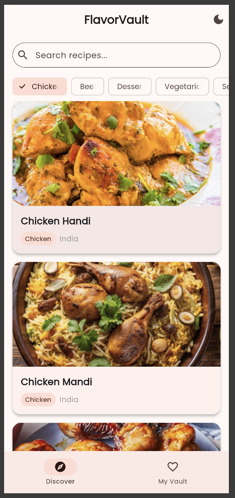
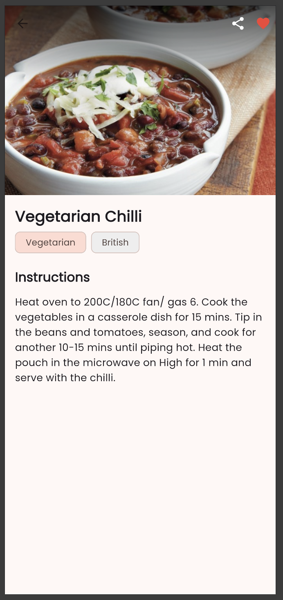
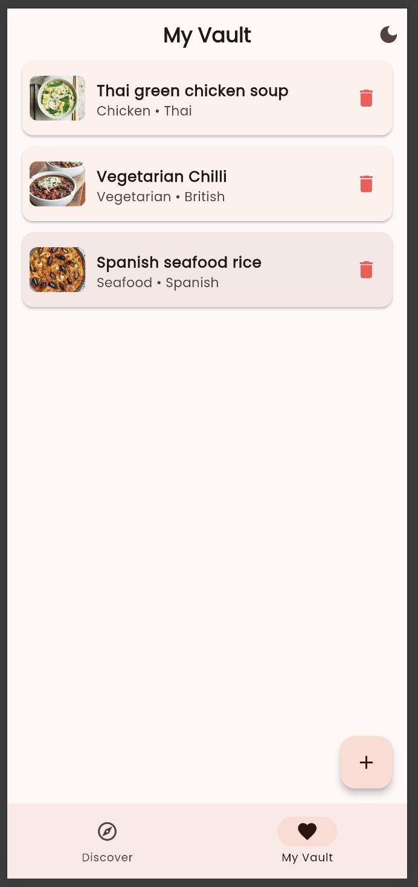
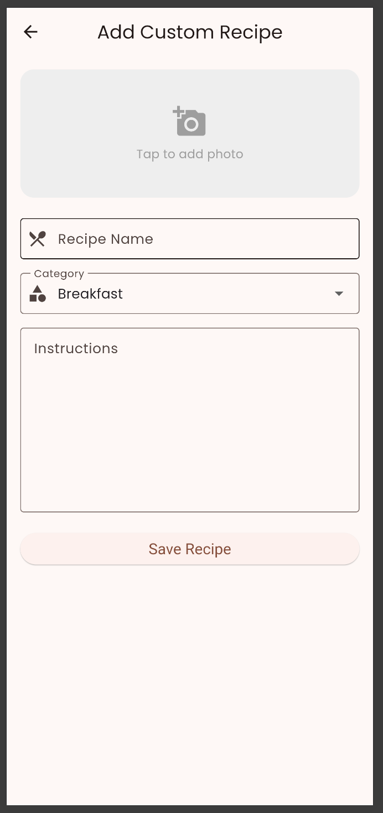

# FlavorVault 🍽️

**FlavorVault** is a modern, responsive Flutter application designed for recipe discovery and personal meal management. Built as the final project for the **Development of Mobile Applications (COS211)** module, this app acts as a personalized digital cookbook.

## Features ✨
- **Discover Recipes**: Browse a live database of recipes via the TheMealDB API.
- **Search & Filter**: Search recipes by name or quickly filter using category chips (Chicken, Beef, Vegetarian, etc.).
- **Offline Vault**: Save your favorite recipes locally using `SharedPreferences` to access them without an internet connection.
- **Custom Recipes**: Add your own personal recipes complete with custom images from your gallery.
- **Dark Mode**: Seamless light and dark mode toggling using an advanced `ThemeProvider`.
- **Native Sharing**: Share your favorite recipes natively with friends using the `share_plus` package.

## Tech Stack & Architecture 🛠️
This app implements a clean MVVM-like architecture separating business logic from the UI.
- **State Management**: `provider` (ChangeNotifier)
- **Local Storage**: `shared_preferences`
- **Network / API**: `http` (TheMealDB REST API)
- **UI Components**: Material 3, CustomScrollView, SliverAppBar, Hero animations.

## Getting Started 🚀

### Prerequisites
- Flutter SDK (latest stable version)
- Dart SDK

### Installation
1. Clone the repository:
   ```bash
   git clone https://github.com/theomonboyev/flavor_vault.git
   ```
2. Navigate to the project directory:
   ```bash
   cd flavor_vault
   ```
3. Install dependencies:
   ```bash
   flutter pub get
   ```
4. Run the app:
   ```bash
   flutter run
   ```

## Screenshots 📱
<p float="left">
  
  
  
  
</p>

## License
This project was built for educational purposes as part of the COS211 module.
